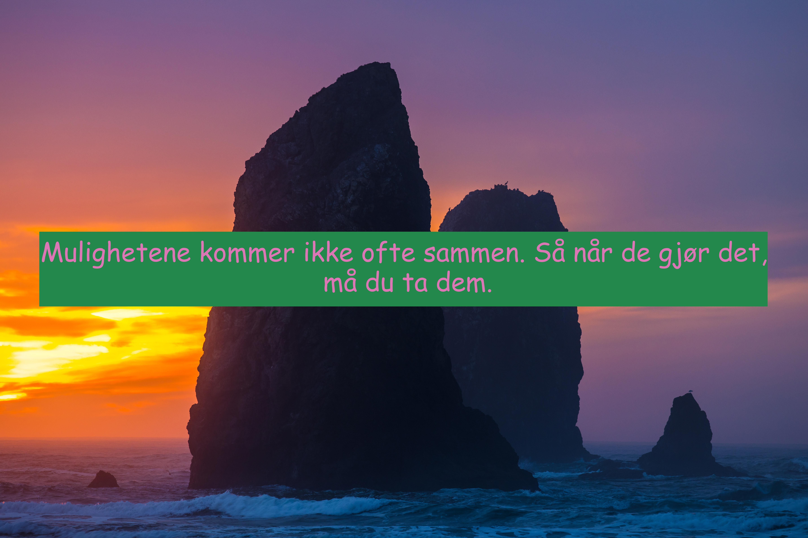
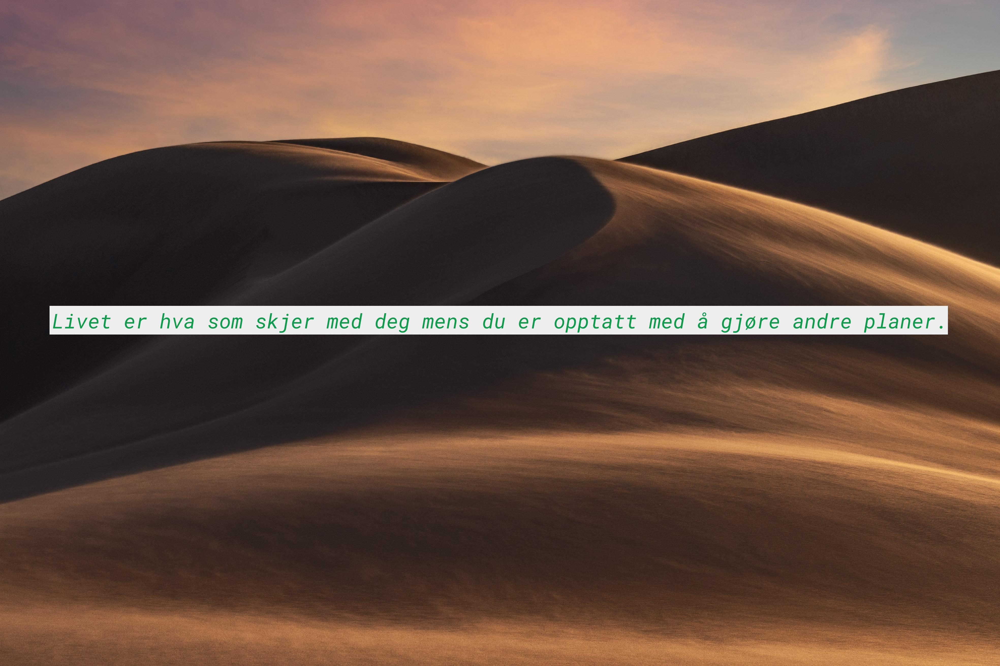

# Affirmasjoner

Et kort og enkelt python script som lager fine bilder med affirmasjoner til deg og dine venner

## Eksempler






## Hvordan funker magien?

Alle sitatene blir hentet fra [https://zenquotes.io/](https://zenquotes.io/).
Når de kommer derfra er de på engelsk, så vi bruker Google Translate sin API for å oversette dem til norsk.

Deretter sjekker vi lengden på teksten og deler den opp etter behov, så bruker vi [Pillow] for å legge en boks og teksten på bildet.

## Hvordan bruke

Fontene som kan bli brukt på bildet ligger i `/fonts/` mappen. Om du vil velge en egen font kan du legge den inn i mappen her også spesifisere det i `make_affirmation()`.

Scriptet trenger også en **[praw.ini](https://praw.readthedocs.io/en/latest/getting_started/configuration/prawini.html)** fil for å fungere, formatet på den er litt som dette

```ini
[DEFAULT]
# A boolean to indicate whether or not to check for package updates.
check_for_updates=True

# Object to kind mappings
comment_kind=t1
message_kind=t4
redditor_kind=t2
submission_kind=t3
subreddit_kind=t5
trophy_kind=t6

# The URL prefix for OAuth-related requests.
oauth_url=https://oauth.reddit.com

# The amount of seconds of ratelimit to sleep for upon encountering a specific type of 429 error.
ratelimit_seconds=5

# The URL prefix for regular requests.
reddit_url=https://www.reddit.com

# The URL prefix for short URLs.
short_url=https://redd.it

# The timeout for requests to Reddit in number of seconds
timeout=16

[Affirmasjoner]
client_id='DIN KLIENT ID'
client_secret='DIN KLIENT SECRET'
password='DITT REDDIT PASSORD'
username='DITT REDDIT BRUKERNAVN'
user_agent=Affirmasjoner
```

Klient ID og alt det er kan du lage på [Reddit sin apps side](https://www.reddit.com/prefs/apps), bare scroll helt ned og trykk på "create an app".
