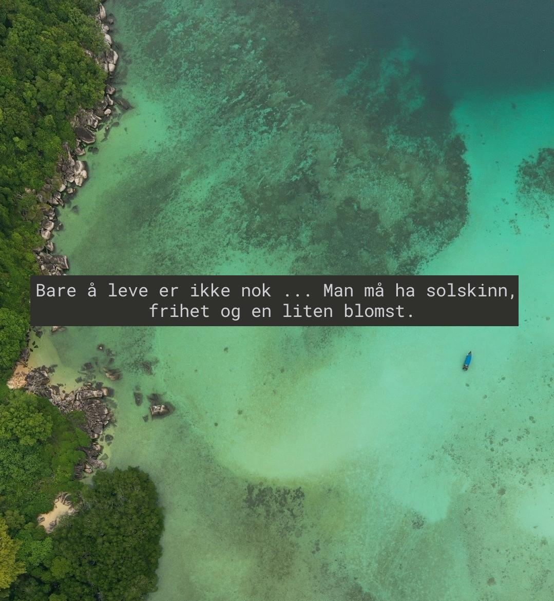

# Affirmasjoner

Et kort og enkelt python script som lager fine bilder med affirmasjoner til deg og dine venner

## Eksempler




## Hvordan funker magien?

Alle sitatene blir hentet fra https://zenquotes.io/
Problemet her var at vi vil gjerne ha dem på norsk, så vi bruker Google Translate sin API får å oversette sitatene.
Denne API'en funker bare av og til, så noen av resultatene vil bli på engelsk dessverre

## Hvordan bruke

Scriptet trenger en **praw.ini** fil for å fungere, formatet på den er litt som dette

```ini
[DEFAULT]
# A boolean to indicate whether or not to check for package updates.
check_for_updates=True

# Object to kind mappings
comment_kind=t1
message_kind=t4
redditor_kind=t2
submission_kind=t3
subreddit_kind=t5
trophy_kind=t6

# The URL prefix for OAuth-related requests.
oauth_url=https://oauth.reddit.com

# The amount of seconds of ratelimit to sleep for upon encountering a specific type of 429 error.
ratelimit_seconds=5

# The URL prefix for regular requests.
reddit_url=https://www.reddit.com

# The URL prefix for short URLs.
short_url=https://redd.it

# The timeout for requests to Reddit in number of seconds
timeout=16

[Affirmasjoner]
client_id='DIN KLIENT ID'
client_secret='DIN KLIENT SECRET'
password='DITT REDDIT PASSORD'
username='DITT REDDIT BRUKERNAVN'
user_agent=Affirmasjoner
```
